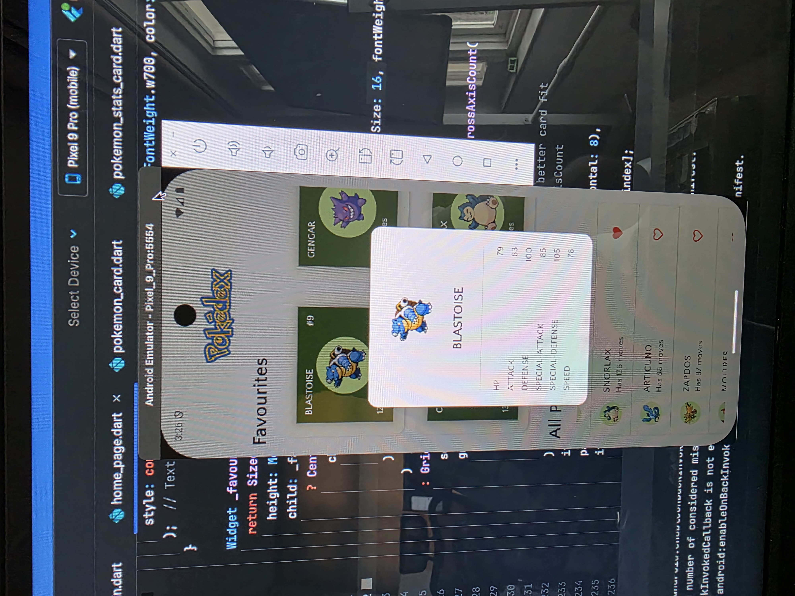

  

<h1 align="center">📱 PokéPod - Flutter Pokédex App</h1>

  A clean, modern Pokédex app built with Flutter and Riverpod package. 
  Browse all Pokémon fetched from the PokéAPI, view detailed stats, and mark your favorites with a seamless user experience.
 

<h2>🚀 Features</h2>
<ul>
  <li>Splash screen with Pokédex image and transition</li>
  <li>Beautiful UI with AppBar image title</li>
  <li>Favorites section (single-row horizontal scroll)</li>
  <li>Main Pokédex list (major screen portion)</li>
  <li>Pokemon details in modal (name, image, stats)</li>
  <li>Riverpod for state management</li>
</ul>

<h2>🗂️ Folder Structure</h2>

<pre><code>
pokipod/
├── assets/
│   └── pokedex.png
├── controllers/
│   └── home_page_controller.dart
├── models/
│   └── pokemon.dart
│   └── page_data.dart
├── pages/
│   ├── home_page.dart
│   ├── splash_screen.dart
├── providers/
│   ├── pokemon_data_providers.dart
│   └── favourite_pokemons_provider.dart
├── services/
│   ├── database_service.dart
│   ├── http_service.dart
├── widgets/
│   ├── pokemon_card.dart
│   └── pokemon_list_tile.dart
│   ├── pokemon_stats_card.dart
├── pokedex.dart
├── main.dart
├── pubspec.yaml
└── README.md
</code></pre>

<h2>📸 Screenshots</h2>

  
  

<h2>⚙️ Getting Started</h2>

<pre><code>
git clone git@github.com:your-username/pokipod.git
cd pokipod
flutter pub get
flutter run
</code></pre>

